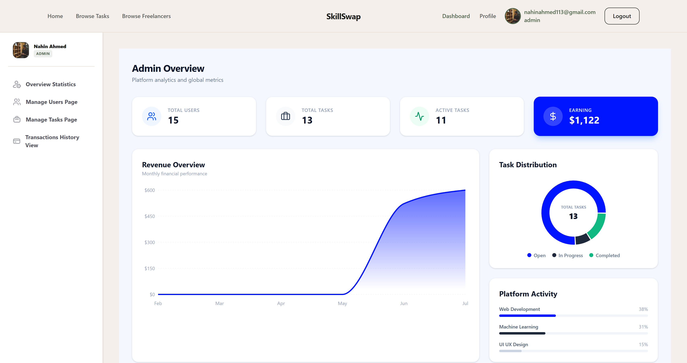

# SkillSwap — Freelance Micro-Task Platform

> A full-stack freelance marketplace where clients post small tasks, freelancers apply with proposals, and payments are processed securely via Stripe Checkout.

---

## 🌐 Live Demo

🔗 [https://skillswap-one-vert.vercel.app](https://skillswap-one-vert.vercel.app)

---

## 📁 Repositories

| Part | Link |
|---|---|
| Frontend (Client) | [github.com/nahin113/skillswap](https://github.com/nahin113/skillswap) |
| Backend (Server) | [github.com/nahin113/skillswap-server](https://github.com/nahin113/skillswap-server) |

---

## 📸 Screenshots

> Replace the paths below with your actual screenshots before publishing.





---

## 📌 Project Overview

SkillSwap is a freelance micro-task marketplace — a simpler version of Fiverr or Freelancer.com built for fast, one-time jobs. Clients post small tasks like logo design, article writing, or bug fixing. Freelancers browse open tasks, submit proposals, and get hired. Payment is handled via Stripe Checkout before work begins.

**Problem it solves:** Many people need quick help with small online tasks but cannot afford big agencies. Freelancers need an easy platform to find short-term work and get paid reliably.

---

## 🎭 User Roles

| Role | Access |
|---|---|
| **Client** | Post tasks, manage proposals, approve freelancers, pay via Stripe |
| **Freelancer** | Browse tasks, submit proposals, track earnings, submit deliverables |
| **Admin** | Manage all users, tasks, and view transaction history |

---

## 🔐 Demo Credentials

| Role | Email | Password |
|---|---|---|
| Admin | admin1@taskhive.com | Admin1@taskhive.com |
| Freelancer | freelanceruser3@gmail.com | Freelanceruser3@gmail.com |
| Client | clientuser3@gmail.com | Clientuser3@gmail.com |

---

## ✨ Key Features

**Authentication**
- Email/password registration with role selection (Client or Freelancer)
- Google OAuth — automatically assigns Client role
- JWT stored in HTTPOnly cookies for secure session management
- Role-based protected routes with middleware guards

**Client Features**
- Post tasks with title, category, description, budget, and deadline
- View and manage all posted tasks with live status labels
- Review freelancer proposals and accept/reject them
- Pay via Stripe Checkout — payment required before work begins
- Edit tasks while status is Open; delete tasks with no accepted proposals

**Freelancer Features**
- Browse and search open tasks with title search and category filter
- Submit one proposal per task with budget, estimated days, and cover note
- Track all proposals with status (Pending / Accepted / Rejected)
- Submit deliverable URL on completion
- View earnings breakdown by task

**Admin Features**
- View platform-wide statistics — users, tasks, revenue, active tasks
- Block and unblock user accounts
- Delete tasks that violate platform guidelines
- View full Stripe transaction history

**Additional Features**
- Server-side pagination on Browse Tasks (9 tasks per page)
- Real-time category filtering and title search without page reload
- Stripe payment success page with task and payment confirmation
- Custom 404 and forbidden error pages
- Fully responsive layout — mobile, tablet, and desktop

---

## 🛠️ Tech Stack

| Category | Technology |
|---|---|
| Framework | Next.js 16 (App Router) |
| UI Library | HeroUI, Tailwind CSS v4, Framer Motion |
| Icons | Lucide React, React Icons, Gravity UI Icons |
| Charts | Recharts |
| Authentication | BetterAuth (Credential + Google OAuth) |
| Database | MongoDB (via official MongoDB driver + BetterAuth Mongo Adapter) |
| Payments | Stripe Checkout |
| Notifications | React Toastify |
| Deployment | Vercel (Frontend + Backend) |

---

## 📦 NPM Packages

### Frontend

| Package | Purpose |
|---|---|
| `next` | React framework with App Router |
| `react` / `react-dom` | Core UI library |
| `@heroui/react` | UI component library |
| `tailwindcss` | Utility-first CSS styling |
| `framer-motion` | Animations and transitions |
| `better-auth` | Authentication (Credential + Google OAuth) |
| `@stripe/stripe-js` | Stripe frontend integration |
| `recharts` | Dashboard charts and statistics |
| `react-toastify` | Toast notifications |
| `lucide-react` | Icon library |
| `react-icons` | Additional icon sets |
| `mongodb` | MongoDB client |

### Backend

| Package | Purpose |
|---|---|
| `express` | Node.js web framework |
| `mongoose` | MongoDB object modeling |
| `stripe` | Stripe server-side payment processing |
| `better-auth` | Auth session management |
| `dotenv` | Environment variable management |
| `cors` | Cross-origin resource sharing |

---

## 🗃️ Database Schema

**Collections:** `users` · `tasks` · `proposals` · `payments` · `reviews`

| Collection | Key Fields |
|---|---|
| users | name, email, image, role, skills, bio, isBlocked, createdAt |
| tasks | title, category, description, budget, deadline, client_email, status, deliverable_url |
| proposals | task_id, freelancer_email, proposed_budget, estimated_days, cover_note, status |
| payments | client_email, freelancer_email, task_id, amount, transaction_id, payment_status |
| reviews | task_id, reviewer_email, reviewee_email, rating, comment |

---

## 🚀 Getting Started

### Prerequisites

- Node.js v18+
- MongoDB URI (Atlas or local)
- Stripe account (test mode keys)
- Google OAuth credentials

### Installation

```bash
# Clone the frontend
git clone https://github.com/nahin113/skillswap.git
cd skillswap
npm install

# Clone the backend
git clone https://github.com/nahin113/skillswap-server.git
cd skillswap-server
npm install
```

### Environment Variables

**Frontend `.env.local`**
```env
NEXT_PUBLIC_API_URL=http://localhost:5000
BETTER_AUTH_SECRET=your_better_auth_secret
BETTER_AUTH_URL=http://localhost:3000
GOOGLE_CLIENT_ID=your_google_client_id
GOOGLE_CLIENT_SECRET=your_google_client_secret
NEXT_PUBLIC_STRIPE_PUBLISHABLE_KEY=your_stripe_publishable_key
STRIPE_SECRET_KEY=your_stripe_secret_key
MONGODB_URI=your_mongodb_uri
```

**Backend `.env`**
```env
PORT=5000
MONGODB_URI=your_mongodb_uri
STRIPE_SECRET_KEY=your_stripe_secret_key
CLIENT_URL=http://localhost:3000
```

### Run Locally

```bash
# Start backend
cd skillswap-server
npm run dev

# Start frontend
cd skillswap
npm run dev
```

Open [http://localhost:3000](http://localhost:3000) in your browser.

---

## 🔗 API Endpoints

| Method | Endpoint | Description | Access |
|---|---|---|---|
| GET | `/tasks` | Get all tasks with pagination and filters | Public |
| GET | `/tasks/:id` | Get single task by ID | Public |
| POST | `/tasks` | Create a new task | Client |
| PATCH | `/tasks/:id` | Update task details or status | Client |
| DELETE | `/tasks/:id` | Delete a task | Client / Admin |
| GET | `/proposals` | Get proposals by task or freelancer | Private |
| POST | `/proposals` | Submit a new proposal | Freelancer |
| PATCH | `/proposals/:id` | Accept or reject a proposal | Client |
| GET | `/users` | Get all users | Admin |
| PATCH | `/users/:id/block` | Block or unblock a user | Admin |
| GET | `/payments` | Get all transactions | Admin |
| POST | `/create-checkout-session` | Create Stripe checkout session | Client |
| GET | `/confirm-session` | Verify payment and update DB | Client |

---

## 🧪 Manual Test Cases

| Test | Steps | Expected Result |
|---|---|---|
| Client registration | Register with email/password, select Client role | Redirected to Home page |
| Freelancer registration | Register with email/password, select Freelancer role | Redirected to Freelancer Dashboard |
| Google OAuth | Click Google sign-in | Assigned Client role automatically |
| Post a task | Login as Client → Post Task form → Submit | Task appears in My Tasks with Open status |
| Submit proposal | Login as Freelancer → Browse Tasks → Submit proposal | Proposal appears with Pending status |
| Accept proposal | Login as Client → Manage Proposals → Accept | Redirected to Stripe Checkout |
| Payment flow | Complete Stripe test payment | Task status updates to In Progress |
| Submit deliverable | Login as Freelancer → Active Projects → Submit URL | Task marked as Completed |
| Admin block user | Login as Admin → Manage Users → Block | User loses login access |
| Pagination | Browse Tasks page | Shows 9 tasks per page with Previous/Next buttons |
| Search + filter | Type in search bar + select category | Results update without page reload |
| Private route protection | Access /dashboard without login | Redirected to /login |
| Role mismatch | Access /dashboard/admin as Client | Redirected to /forbidden |
| Page refresh | Refresh any dashboard page while logged in | Page loads correctly, no redirect to login |

---

## ⚠️ Known Limitations

- No real-time notifications — proposal status changes require a page refresh to reflect
- Admin accounts are hardcoded into the database — no admin registration flow
- Stripe is running in test mode — real payments are not processed
- No file upload support — deliverables must be submitted as external URLs
- Reviews are stored in the database but the review display UI is not fully implemented

---

## 🔮 Future Improvements

- Real-time notifications using WebSockets or Server-Sent Events
- Dark/Light theme toggle with persistent user preference
- Task bookmarking for freelancers to save interesting jobs
- Freelancer verification badge managed by admin
- Client rating system — freelancers can review clients after task completion
- File upload support for deliverable submission
- Email notifications on proposal status changes

---

## 👨‍💻 Author

**Nahin Ahmed**
- Portfolio: [nahinahmed.vercel.app](https://nahinahmed.vercel.app)
- LinkedIn: [linkedin.com/in/nahinahmed](https://www.linkedin.com/in/nahinahmed)
- GitHub: [github.com/nahin113](https://github.com/nahin113)
- Email: nahinahmed113@gmail.com

---

## 📄 License

This project is open source and available under the [MIT License](LICENSE).
